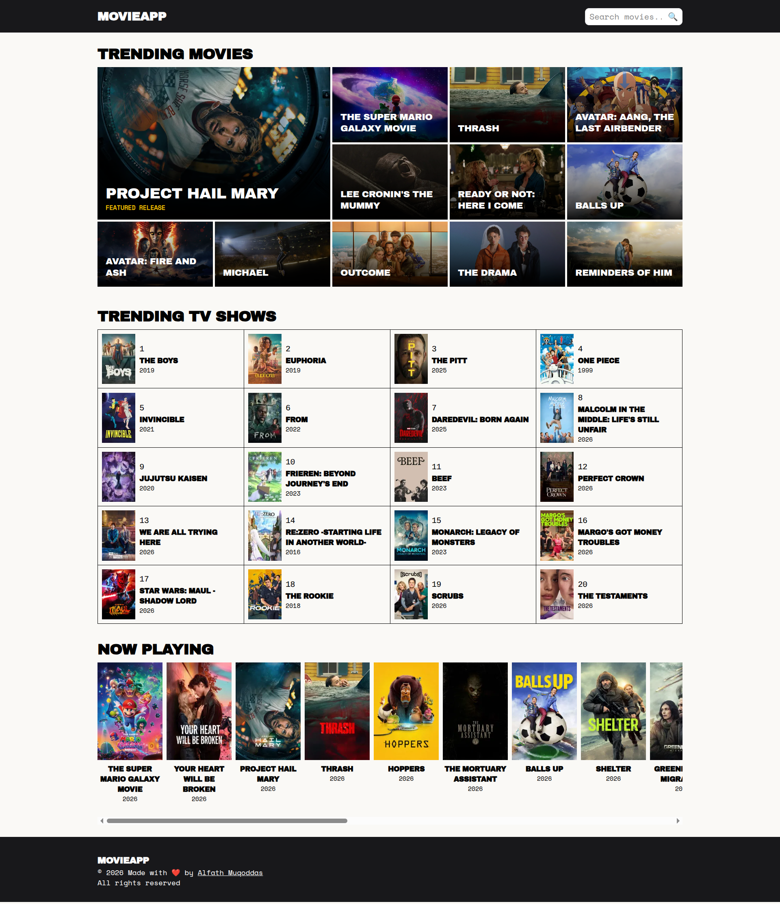
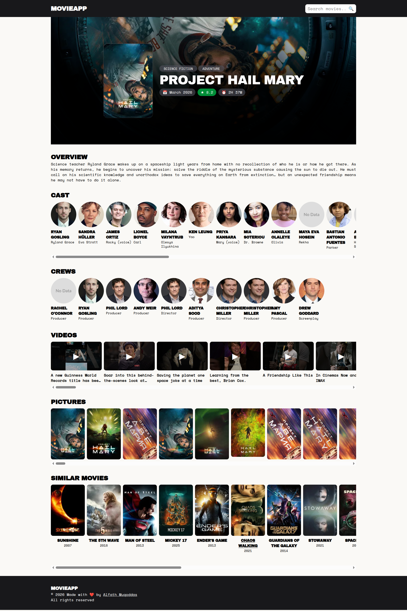
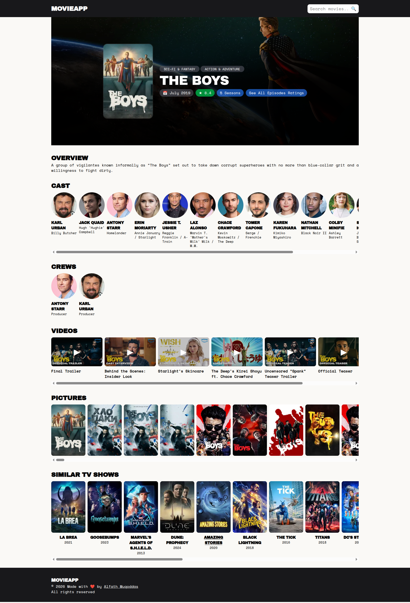
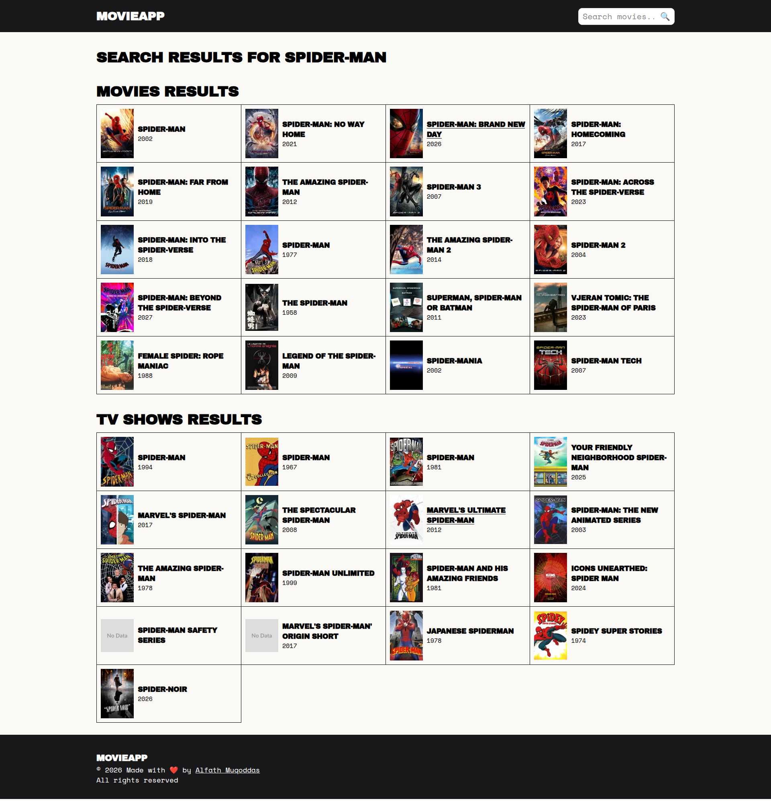

# Astro + Cloudflare Movie App

This is a simple movie app built with Astro and Cloudflare Pages. It uses the TMDB API to fetch movie and TV show details, cast, videos, crews, and more. The app is deployed on Cloudflare Pages and uses Cloudflare Workers to fetch data from the TMDB API.

## Features

- Fetch movie and TV show details, cast, videos, crews, and more from the TMDB API.
- Display movie and TV show details, cast, videos, crews, and more on the app.
- Search for movies and TV shows using the search bar.
- Display movie and TV show recommendations based on the user's search query.
- Display movie and TV show now playing on the app.
- Display movie and TV show trending on the app.
- Display movie and TV show popular on the app.

## Getting Started

To get started, follow these steps:

1. Clone the repository:

```bash
git clone https://github.com/alfathmuqoddas/astro-cloudflare-movie-app.git
```

2. Navigate to the project directory:

```bash
cd astro-cloudflare-movie-app
```

3. Install the dependencies:

```bash
npm install
```

4. Start the development server:

```bash
npm run dev
```

5. Open your browser and navigate to `http://localhost:4321`.

## Deployment

To deploy the app, follow these steps:

1. Install the `wrangler` CLI:

```bash
npm install -g wrangler
```

2. Login to your Cloudflare account:

```bash
wrangler login
```

3. Configure your Cloudflare account:

```bash
wrangler config
```

4. Set the `account_id` and `zone_id` in the `wrangler.toml` file.

5. Build the project:

```bash
npm run build
```

6. Deploy the project:

```bash
wrangler publish
```

## Screenshots

- Home Page
  

- Movie Details
  

- TV Show Details
  

- Search Page
  

## License

This project is licensed under the MIT License.
